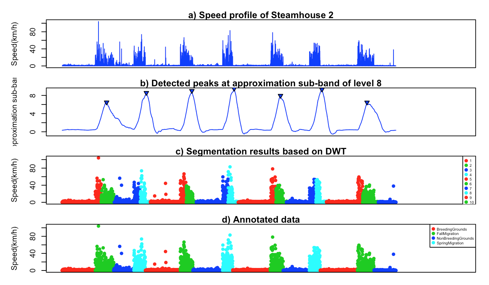

# Discrete Wavelet Transform based Segmentation of Trajectories
This repository implements the procedure from Soleymani et al. (2017) for applying a DWT-based segmentation on trajectories of turkey vultures in R.

* See [here](https://munterfinger.github.io/dwt-based-segmentation/) for the R code and a detailed description.
* See [here](http://onlinelibrary.wiley.com/doi/10.1111/2041-210X.12755/abstract) for the original MatLab version.

## Prerequisites

* [R](https://www.r-project.org/) - R is a free software environment for statistical computing and graphics.
* [RStudio](https://www.rstudio.com/) - Open source and enterprise-ready professional software for R.

## Author

* **Merlin Unterfinger** - *eRTG3D* - [munterfinger](https://github.com/munterfinger)