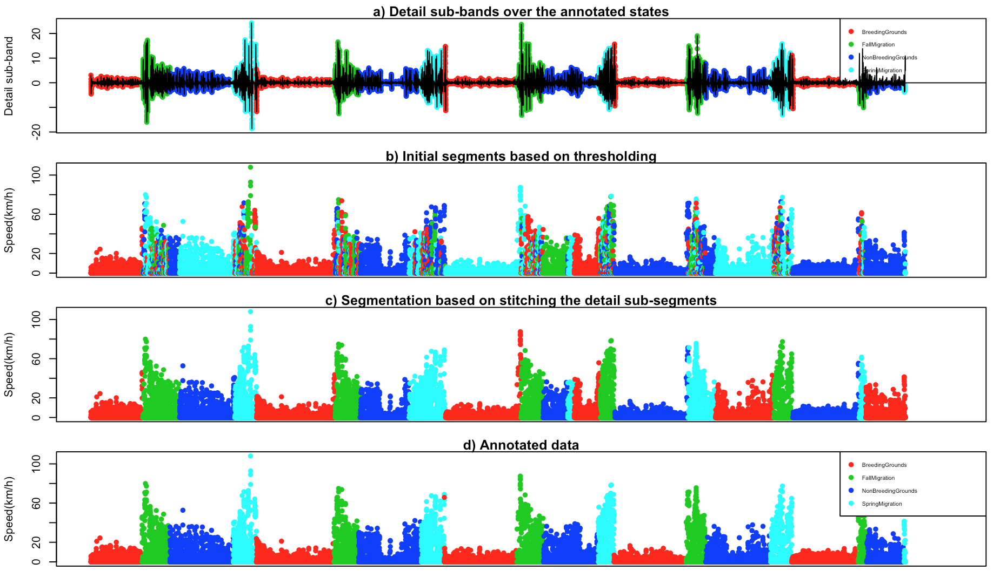

# Discrete Wavelet Transform based Segmentation of Trajectories
This repository implements the procedure from Soleymani et al. (2017) for applying a DWT-based segmentation on trajectories of turkey vultures in R.

* See [here](https://munterfinger.github.io/dwt-based-segmentation/) for the R code and a detailed description.
* See [here](http://onlinelibrary.wiley.com/doi/10.1111/2041-210X.12755/abstract) for the article by Soleymani et al. (2017).
* See [here](http://dx.doi.org/10.5441/001/1.46ft1k05) for the tracking data of the turkey vultures by Dodge et al. (2014).

|||
|---|---|

## Prerequisites

* [R](https://www.r-project.org/) – R is a free software environment for statistical computing and graphics.
* [RStudio](https://www.rstudio.com/) – Open source and enterprise-ready professional software for R.

## Author

* **Merlin Unterfinger** – [munterfinger](https://github.com/munterfinger)

## References
Dodge, G. Bohrer, K. Bildstein, S. C. Davidson, R. Weinzierl, M. J. Bechard, D. Barber, et al. 2014. “Environmental drivers of variability in the movement ecology of turkey vultures (Cathartes aura) in North and South America.” Philosophical Transactions of the Royal Society B: Biological Sciences 369 (1643): 20130195–5. doi:10.1098/rstb.2013.0195.

Soleymani, Ali, Frank Pennekamp, Somayeh Dodge, and Robert Weibel. 2017. “Characterizing Change Points and Continuous Transitions in Movement Behaviours Using Wavelet Decomposition.” Methods in Ecology and Evolution 8 (9): 1113–23. doi:10.1111/2041-210X.12755.