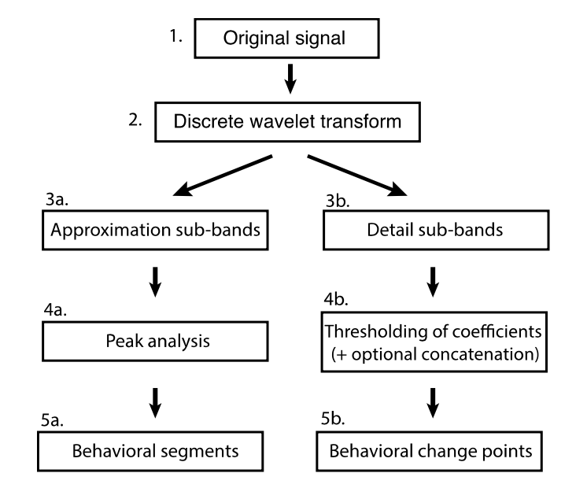

<style>
body {
text-align: justify}
</style>


```{r setup, include=FALSE}
knitr::opts_chunk$set(echo = TRUE, fig.show = 'hold', fig.align = 'center', fig.height = 4.5, out.width = '100%')
rm(list = ls())
cat("\014")
```

# Background
Method description and flowchart by @Soleymani:
 
"In Step 1, the movement parameter profile (i.e. time series of the chosen movement parameter; speed in our example) is calculated from the raw movement data, acting as the input for the DWT transform. In Step 2, the movement signal is decomposed by the DWT. This transformation yields two outputs: low frequency approximation sub- bands (3a) and high frequency detail sub-bands (3b). These two resulting sets of sub-bands will be used for different purposes in the next stage and therefore the procedure bifurcates into two different branches, along which different analyses will be performed. Peak analysis will be performed on approximation sub-bands (Step 4a) in order to obtain behavioural segments (Step 5a), while thresholding of detail sub-bands (Step 4b) will be used to detect behavioural change points (Step 5b)."

```{r, out.width = '50%', fig.align='center', echo = FALSE}

```

# Data set
"We use four GPS tracks of turkey vultures (C. aura) from the interior North America population to illustrate the segmentation method on real data. As shown in Fig. 3, the migration path extends from Canada to South America across central regions of North America. These birds show several states during their annual migrations: (i) breeding areas in North America, (ii) outbound migration in the Fall from breeding areas to wintering grounds, (iii) tropical wintering grounds in South America, and (iv) return migration to breeding grounds in the Spring. The data were manually classified into the above-mentioned behavioural states (four segments) by domain experts as discussed in @Dodge" [@Soleymani].
[Download link data](http://dx.doi.org/10.5441/001/1.46ft1k05)

```{r, warning = FALSE, message = FALSE}
# Reading the input file (speed and annotations)
rawData <- read.csv2("data/Turkey-Vulture-Leo.csv", sep = ",")
speed <- as.numeric(as.character(rawData[,35]))
states <- rawData[,12]

# Check for emtpy states and assign them the following
for(i in which(states == '')) {
  t <- i; while(states[t] == ''){t <- t + 1}
  states[i] <- states[t]
}
states <- droplevels(states) # update factor levels

# Create x axis for plotting
tt = seq(1, length(speed))

# Plotting step length profile versus annotations
par(mfrow = c(2, 1), mar=c(0.1,4,0.8,2)+0.1,
    oma=c(5,0,3,0)+0.1, xaxt='n')
plot(speed,
     type = "l",
     xlim=c(1, length(speed)+2000),
     col = "blue", ylab = 'Speed(km/h)',
     main = "Profile of speed over time")
plot(speed,
     type = "p", pch=16,
     xlim=c(1, length(speed)+2000),
     col = states,
     ylab = 'Speed(km/h)',
     main = "Annotation data")
legend("topright", legend=levels(states),
       pch=16, pt.cex=1, cex = 0.5, col=unique(states))
```

# Discrete wavlet transform
"From the raw trajectory a movement parameter profile (i.e. speed in this case) is computed, serving as the input to the DWT analysis ... . The DWT is flexible regarding the input movement signal and different movement metrics can be used for the analysis (e.g. acceleration, turning angles). Based on biological domain knowledge, movement speed seems a reasonable choice to distinguish between migratory versus non-migratory phases and therefore was selected here as the movement signal. In the next step, the movement signal is decomposed through the discrete wavelet transform. To do so, a mother wavelet function needs to be chosen. The family of Daubechies are a well-known class of wavelet function and the order 4 (db4) was chosen according to similar application of DWT in the literature. Other mother wavelet functions are available (e.g. Haar, Morlet, Mexican hat) and their application depends on the shape of the response one is interested in [@boggess]. For instance, certain wavelet functions are able to resolve small, abrupt discontinuities, whereas others may better capture linear changes in the movement. In general, we recommended to use db4 for the application of our method. The outputs of the DWT decomposition are two sets of approximation and detail sub-bands ... ." [@Soleymani].

"For both the approximation and the detail sub-bands, the selection of 
appropriate decomposition levels is done by visual inspection of the sub-bands ... ." [@Soleymani].
```{r}
# Specify levels of DWT
L <- 10

# Discrete wavelet transform
sig <- speed
DWT <- wavelets::modwt(sig, filter="d4", n.levels = L)
a <- DWT@V # approximation sub-bands
d <- DWT@W # detail sub-bands

# Plot approximation and detail sub-bands
par(mfrow=c(L+1,1), mar=c(0,4,0,2)+0.1,
    oma=c(5,0,3,0)+0.1, xaxt='n')
plot(sig, type = "l", col = "red",ylab = "s")
for (i in 1:L) {
  plot(a[[i]], type = "l",
       col = "blue",
       ylab = paste("a", i, sep=""))
}
title("Signal and approximation sub-bands", outer=TRUE)
plot(sig, type = "l", col = "red",ylab = "s")
for (i in 1:L) {
  plot(d[[i]], type = "l",
       col = rgb(0.2, 0.6, 0.2),
       ylab = paste("d", i, sep=""))
}
title("Signal and detail sub-bands", outer=TRUE)
```

# Behavioural segmentation using the approximation sub-bands
## Peak analysis
"Visual inspection of the different approximation sub-bands shows that level [9] can be an appropriate level in this case because peaks are adequately distinguished from the rest of the signal indicating periodic patterns. (...) at the initial levels of decomposition, the localization effects are not strong enough yet to suggest differences between migration phases, which also make it impossible to apply any peak analysis. However, the localization effect is becoming stronger with increasing levels, which can be clearly seen in the resulting peaks versus flat regions at the Levels [8, 9 and 10]. Therefore, the goal is to reach a level where segments related to the same behaviour are expressed in peaks with similar height and widths. Accordingly, level [9] was finally chosen because distinct phases became apparent as the level where peak analysis can potentially distinguish between different segments. (...) The user is recommended to carefully inspect the variation of the resulting peaks and choose the level, as well as peak height, where he/she thinks that it would work best to distinguish among different phases in the data" [@Soleymani].

For this step the function `findpeaks()` has to be loaded. The function is a modification a function from the `pracma` package to get the same outputs as the original `findpeaks()` function from MatLab returns.

```{r fig.height=3.5}
# Choose approximation sub-band
aBandNumber <- 9
app <- c(a[[aBandNumber]])

# Load function 'findpeaks()'
source("R/findpeaks.R")

# Finding the extremum values: in this case it is maxima
minHeight <-  3.5
minDist <- 1000
npeaks <- Inf
par(mfrow=c(1,1), mar=c(0,4,0,2)+0.1, oma=c(5,0,3,0)+0.1, xaxt='s')
pks <- findpeaks(app, minpeakheight = minHeight,
                 minpeakdistance = minDist, plot = TRUE, npeaks = npeaks)
```

## Segmentation based on the extents of peaks
" ... the peaks related to migratory seasons are well distinguished from the rest of the signal and the combination of the height and the width of the peaks will help to identify the segments." [@Soleymani].

```{r}
# Use the peak width to define the trajectory segments,
# pks[ ,5] is the left and pks[ ,6] the right border,
# of the peak at half the prominence's height.
segLims <- Reduce(c, apply(X = pks, MARGIN = 1, FUN = function(X){c(X[5], X[6])}))
segLims <- c(segLims, length(sig))
nSegs <- length(segLims)
segmentNum <- nSegs
segmentsApp <- numeric(tail(segLims,1))
for (i in nSegs:1) {
  segmentsApp[1:segLims[i]] <- segmentNum
  segmentNum <- segmentNum-1
}
```

## Results
```{r}
par(mfrow = c(4, 1),mar = c(1, 4, 1, 2) + 0.1,
    oma = c(5, 0, 3, 0) + 0.1, xaxt = 'n')

# Ploting the original signal
plot(sig, 
     type = "l", col = "blue",
     xlim = c(1, length(speed) + 2000),
     ylab = 'Speed(km/h)',
     main = "a) Speed profile of Leo")

# Approximation sub-band and the detected peaks
plot(app,
     type = "l", col = "blue",
     xlim = c(1, length(speed) + 2000),
     ylab = 'Approximation',
     main = paste("b) Detected peaks at approximation sub-band of level",
                  aBandNumber))
points(pks[, 2], pks[, 1] + 0.25, pch = 25, bg = "blue")
for (p in 1:nrow(pks)) {
  lines(rep(pks[p, 2],2), c(pks[p, 1]-pks[p, 4], pks[p, 1]), col = rgb(1, 0.6, 0))
  lines(c(pks[p, 5], pks[p, 6]), rep(pks[p, 4]/2,2), col = rgb(1, 0.6, 0))
}

# Results of segmentation based on the extents (widths) of peaks
palette(c("red", "green3", "blue", "cyan"))
plot(speed,
     type = "p", pch = 16,
     xlim = c(1, length(speed) + 2000),
     col = as.factor(segmentsApp),
     ylab = 'Speed(km/h)',
     main = "c) Segmentation results based on DWT")
legend("topright",
       legend = levels(as.factor(segmentsApp)),
       pch = 16, pt.cex = 1, cex = 0.5,
       col = unique(as.factor(segmentsApp)))

# Annotations
plot(speed,
     type = "p", pch = 16,
     xlim = c(1, length(speed) + 2000),
     col = states,
     xlab = 'Years', ylab = 'Speed(km/h)',
     main = "d) Annotated data")
legend("topright", legend = levels(states),
       pch = 16, pt.cex = 1, cex = 0.5,
       col = unique(states))
```

# Change point analysis using the detail sub-bands
## Choose detail sub-band
"Since the detail sub-bands contain the high-frequency information, the analysis based on these sub-bands focuses on the detection of fine-scale changes in movement. Same as with the approximation, first the relevant level for the detail sub-bands needs to be selected. This is also done by visual inspection of the detail sub-bands and further informed by previous knowledge regarding at which level biologically-driven changes may occur. (...) at Level 5 one can start to observe the different regimes of values for migratory and non-migratory phases, as well as some finer-scale changes within these phases. Therefore level 5 is selected for further analysis" [@Soleymani].
```{r fig.height=3.5}
# Choose detail sub-band
dBandNumber <- 5
det <- d[[dBandNumber]]
```

## Initial segments based on thresholding
"The next step is to identify change points by setting a threshold for the difference between the wavelet coefficients ... . The value of this threshold also depends on the data used. For example in this case, the detail coefficients in the non-migratory season are around zero at the selected Level 5, whereas the values in the migratory seasons are much higher. Therefore a value of 1.0 was selected to identify the change points, that is, every point whose coefficient value is 1.0 units higher than the value of its preceding point" [@Soleymani].

```{r fig.height=3.5}
# Set threshold
threshold <- 1

# Detecting frequency breaks
frqdif <- c(which(diff(abs(det)) > threshold), length(det))

# Split into inital segements based on the threshold above
splitAt <- function(x, pos) unname(split(x, cumsum(seq_along(x) %in% pos)))
segList <- splitAt(det, frqdif)

# Labeling inital segments
id <- 0
segmentsDet <- Reduce(c, lapply(X = segList, FUN = function(X) {
  assign("id", id+1, envir=parent.frame(n=2))
  rep(id, length(X))
}))

# Plot initial segments
par(mfrow=c(1,1), mar=c(1,4,1,2)+0.1,
    oma=c(5,0,3,0)+0.1, xaxt='s')
plot(det[,1],
     type = "l",
     col = rgb(0.2, 0.6, 0.2),
     ylab = paste("Detail sub-band", dBandNumber))
abline(v = which(c(0, diff(segmentsDet))==1), col = rgb(1, 0.6, 0, alpha = 0.2))
```

## Segmentation based on stitching the detail sub-segments
"An optional concatenation step to obtain fine scale behavioural segments can be applied. This makes it possible to better match the results to the expected duration of the patterns that are sought (i.e. migratory patterns). In our case, all the segments with a length shorter than 500 fixes (i.e. corresponding to ~20 days) were concatenated to their preceding segment" [@Soleymani].

```{r fig.height=3.5}
# Removing short segments (i.e. <500 fixes)
lengthLimit <- 500

# Concatenate and label the segments
segmentsDetCon <- numeric(0)
id <- 0; vecInd <- 1;
for (i in 1:length(segList)){
  if(length(segList[[i]]) >= lengthLimit) {
    id <- id + 1
    segmentsDetCon <- c(segmentsDetCon, rep(id, length(segList[[i]])))
    id <- id + 1
  } else {
    segmentsDetCon <- c(segmentsDetCon, rep(id, length(segList[[i]])))
  }
}

# Plot concatenated segments
par(mfrow=c(1,1), mar=c(1,4,1,2)+0.1,
    oma=c(5,0,3,0)+0.1, xaxt='s')
plot(det[,1],
     type = "l",
     col = rgb(0.2, 0.6, 0.2),
     ylab = paste("Detail sub-band", dBandNumber))
abline(v = which(c(0, diff(segmentsDetCon))==1), col = rgb(1, 0.6, 0, alpha = 1))
```

## Results
"Same as for the approximation sub-bands, the user is recommended to carefully inspect the variation of the resulting detail sub-bands and choose the level where he/she hypothesizes that different phases in the data are consistent with biological knowledge of the system. Setting the threshold for identifying change points is also dependent on the extent to which finer-scale changes are to be recovered. The concatenation step is totally optional, with the length of segments for concatenation be specified by considering a minimum duration for the patterns of interest. That is in our case, a migration period cannot be shorter than 20 days. Therefore 500 fixes (indicating 20 days) were considered as the minimum length where all the migratory patterns as well as some additional segments were identified" [@Soleymani].

```{r}
# Figure 6
par(mfrow=c(4,1), mar=c(1,4,1,2)+0.1,
    oma=c(5,0,3,0)+0.1, xaxt='n')

# Overlaying detail sub-band over the states
plot(tt, det,
     type = "p", pch=16,
     xlim=c(1, length(speed)+2000),
     col = states, 
     ylab = 'Detail sub-band', 
     main = "a) Detail sub-bands over the annotated states")
legend("topright", legend=levels(states),
       pch=16, pt.cex=1, cex = 0.5, col=unique(states))
lines(tt, det)

# Plotting initial segments based on thresholding
plot(tt, speed,
     type = "p", pch=16,
     xlim=c(1, length(speed)+2000),
     col = as.factor(segmentsDet),
     ylab = 'Speed(km/h)', xlab = 'Years',
     main = "b) Initial segments based on thresholding")

# Results of segmentation based stitching the detail sub-segments
plot(tt, speed,
     type = "p", pch=16,
     xlim=c(1, length(speed)+2000),
     col = as.factor(segmentsDetCon),
     ylab = 'Speed(km/h)',
     main = "c) Segmentation based on stitching the detail sub-segments")

# Annotations
plot(tt, speed,
     type = "p", pch=16,
     xlim=c(1, length(speed)+2000),
     col = states,
     xlab = 'Years', ylab = 'Speed(km/h)',
     main = "d) Annotated data")
legend("topright", legend=levels(states),
       pch=16, pt.cex=1, cex = 0.5, col=unique(states))
```

# References